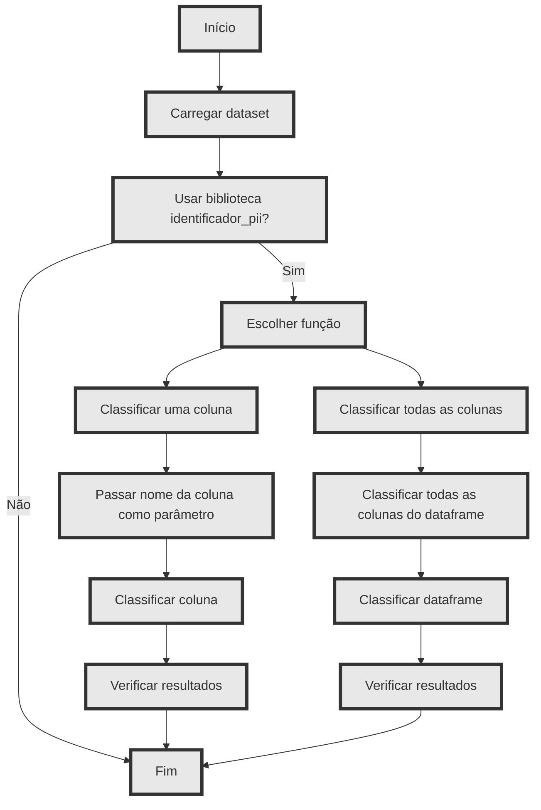

# Início rápido

## Contexto

 Este projeto PII Brasil consiste no resultado do trabalho de conclusão de curso de Pedro Henrique Camapgna para o MBA em Data Science and Analytics USP Esalq. 

> Este pacote visa criar uma ferramenta simples que pode auxiliar pessoas que trbalham com dados a identificar se em um determinado conjunto de dados, existem dados pessoais. Isso porque, ainda que existem outros pacotes e ferramentas dedicadas a fazer o mesmo, muitos deles não estão costumizados para encontrar dados no padrão brasileiro, desde nomes de pessoas à documentos específicos como o Cadastro de Pessoas Físicas (CPF).


## Instalação 

### Instalando o pacote via pip

<code> pip install identificador-pii </code>

## Documentação

Clique [aqui](https://projeto-pii-brasil.readthedocs.io/en/latest/) para ir para a documentação oficial

## Comece aqui

### Classificando uma coluna de um DataFrame


```python

    from identificador_pii.identificador import IdentificadorPII
    import pandas as pd

    a = IdentificadorPII()


    data = {'coluna1': ['12345678901', '98765432109', '123.456.789-01', '987.654.321-09', '123.456.789.01'],
            'coluna2': ['(11) 1234-5678', '(22) 98765-4321', '12345-6789', '98765-4321', '11 12345-6789'],
            'coluna3': ['Fábio Santos', 'Sergio Conceição', 'Maria Souza', 'João Rodrigues', 'Richard Tomiaka' ],
            'coluna4':[15, 200, 456, 22, 765 ]}
    df = pd.DataFrame(data

    a.clasify_column(df, 'coluna1')

```


### Classificando todas as colunas de um DataFrame


```python

    from identificador_pii.identificador import IdentificadorPII
    import pandas as pd

    data = {'coluna1': ['12345678901', '98765432109', '123.456.789-01', '987.654.321-09', '123.456.789.01'],
            'coluna2': ['(11) 1234-5678', '(22) 98765-4321', '12345-6789', '98765-4321', '11 12345-6789'],
            'coluna3': ['Fábio Santos', 'Sergio Conceição', 'Maria Souza', 'João Rodrigues', 'Richard Tomiaka' ],
            'coluna4':[15, 200, 456, 22, 765 ]}
    df = pd.DataFrame(data)

    a.classify_df(df)
```


### Fluxograma de uso da biblioteca


 <br>

### Badges
<br>

[](https://projeto-pii-brasil.readthedocs.io/en/latest/?badge=latest)