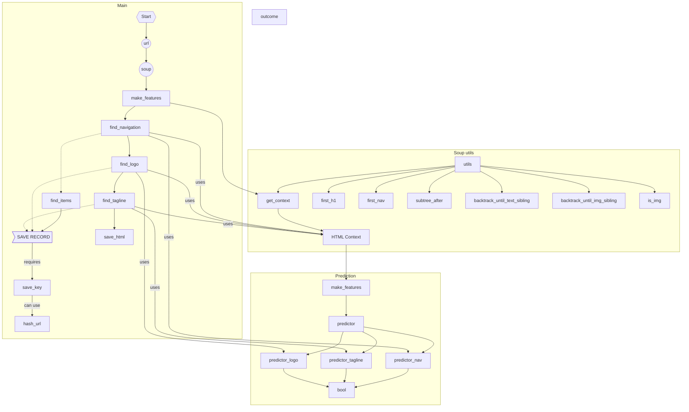

# README


## API

- Given a `url` or a list of `urls`

```
get_main_text([url], size=200, min_paragraph_len=10)
  -> CrawlResponse
get_main_text(urls, size=200, min_paragraph_len=10)
  -> CrawlResponse

- The links only contain text
- The images only contain title if exists

get_main_text_as_markdown([url], size=200, min_paragraph_len=10)
get_main_text_as_markdown(urls, size=200, min_paragraph_len=10)

- Each link contains (text, href) in markdown format
- Each image contains (text, href) in markdown format
```

- CrawlResponse

```
first
items: iterate over each urls
```


## Terminology

LAYOUT OF A PAGE

Landing page main content
```
[title]
[heroline]
[header primary]
[icon url]
```

Landing page navigation
```
<SUBITEM>
  item_label
  item_url
  item_description 
{
  item_label
  item_url
  subitems: [
    <SUBITEM>
  ]
}
```

HTML Node with Coordinate Info
{
  tag
  classtext
  text
  bbpos: {
    x
    y
    w
    h
  }
  nodenr // number of nodes in the html page
}

## bs4 tree navigation functions

### Glossary

- range: the reachable nodes starting of a node

### Functions

- find_closest_hypersibling(backtrack_depth:int, sibling_type:str)

  > go upwards in the tree to an ancestor and search all the range of the ancestor to find the sibling of a certain type. Stop at first encounter.

- ignore_node(n_text:int=1)

- find_header_section

- find_immediate_sibling(sibling_type:str)

## Workflow

find_navigation: its outcome is useful to validate the logo/heroline


