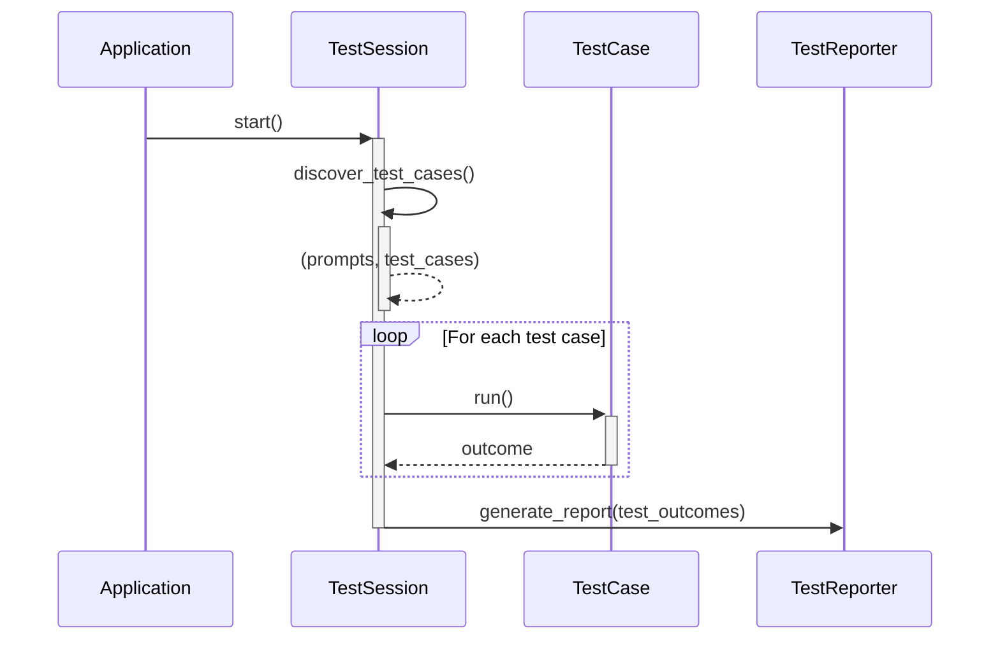

# Runtime scenarios

This section covers key runtime scenarios that are implemented in promptarchitect.

## Running tests

Running tests against prompt files is done via a `TestSession` class. 
A test session has a start and end date. It controls the process starting with discovery, then running the tests and finally reporting the results to a desired output location. 

The process of running tests is shown below.

| Actor name    | Description                                                                       |
| ------------- | --------------------------------------------------------------------------------- |
| TestSession   | The main container for the test process                                           |
| TestDiscovery | The test discovery module.                                                        |
| TestRunner    | The coordinator for a test run.                                                   |
| TestCase      | Implements the test logic for a single test case                                  |
| TestReporter  | Converts outcomes into human-readable information in HTML, The terminal, or JSON. |

Test runs are sequential, because running tests in parallel is likely to result in quota problems with OpenAI and the other LLM providers in the cloud.