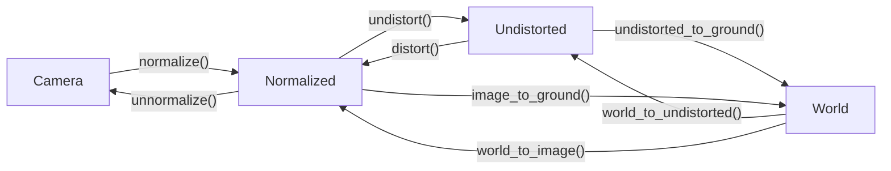

<div align="center">

# Spiideo SoccerNet SynLoc
## Single Frame World Coordinate Athlete Detection and Localization with Synthetic Data

[[Paper](https://arxiv.org/)] [[Baseline](https://github.com/Spiideo/mmpose/tree/spiideo_scenes)] [[Devkit](https://github.com/Spiideo/sskit)]

</div>

>**[Spiideo SoccerNet SynLoc - Single Frame World Coordinate Athlete Detection and Localization with Synthetic Data](https://arxiv.org/)**
>
> ...
>
>[*arxiv*](https://arxiv.org/)
>


Welcome to the Development Kit for the Spiideo SoccerNet SynLoc task and Challange. This kit is meant as a help to get started working with the data and the proposed task.

## Installation
The easiest way to install sskit is to use pip:
```bash
  pip install sskit
```

It is also possible to build manually:
```bash
  git clone https://github.com/Spiideo/sskit.git
  cd sskit
  python setup.py install
```


## Coordinate Systems

There are several different coordinate systems used (se pictures below), and functions to convert points between them. The World coordinates are either 3D or 2D ground coordinates with the last coordinate assumed to be 0.



### Camera Image


### Normalized Image


### Undistorted Image


### Ground Plane

