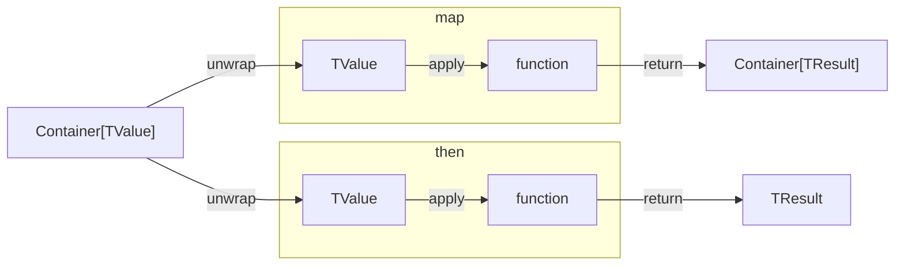

# `tibia`

Simple library that provides some monad-like containers for "pipeline"-based code style.
It is developed with simple idea in mind: important parts of code base (specifically
those that contain domain-specific logic) must be implemented in human-readable manner
as text that describes non-technical (or at least not too) details.

## `Pipeline` & `AsyncPipeline`

`Pipeline` & `AsyncPipeline` are basic building blocks for applying function to data
which is opposite to invoking function with data:

```python
from typing import Any

from tibia.pipeline import Pipeline


def set_admin_status(user: dict[str, Any]) -> dict[str, Any]:
    user['role'] = 'admin'
    return user

# invoke function with data
user_1 = set_admin_status(
    {
        'name': 'John Doe',
        'role': 'member'
    }
)

# apply function to data
user_2 = Pipeline({
        'name': 'John Doe',
        'role': 'member'
    }).then(set_admin_status)
```

With this approach we can build pipelines that process some data performing different
actions in more declarative manner.

Direct analogue of Pipeline and AsyncPipeline is so-called functional "pipe" operator
which is usually written as `|>`:

```fsharp
let result = data |> function // same as `function data`
```

As a general reference to API methods I used rust Option and Result interfaces. As a
general rule:

- `map` unwraps contained value, passes it to the function and returns back wrapped
  result of function invocation
- `then` unwraps contained value, passes it to the function and returns result



In case one needs to invoke some async functions there are `map_async` and `then_async`
methods, that transform `Pipeline` container to `AsyncPipeline` container, which allows
to invoke async functions in non-async context like JavaScript `Promise` or more widely
known `Future`. For naming consistency reasons `AsyncPipeline` is called as it called
instead of being `Future` (also python has some other builtin packages with `Future`
name).

## `Maybe` & `AsyncMaybe`

Monadic container that replaces logic for `Optional` values. Consists of 2 containers:
`Some` & `Empty` where `Some` represents actual value and `Empty` represents absence of
data.

Some might question: do we need additional abstraction for `typing.Optional`? What is
the purpose of `Empty`?

This is small real-life example: one has a table in database with some data, where some
columns are nullable and one wishes to perform update on this data with single
structure.

Structure:

```python
from datetime import datetime
from typing import Optional


class User:
    name: str
    age: int
    crated_at: datetime
    deleted_at Optional[datetime]
```

For field `name`, `age` and `created_at` it seems to be good solution to use `Optional`
as indication of 2 cases:

- one wants to update field (value is not optional)
- one does not want to update field (value is optional)

But for deleted_at `Optional` is one of the possible states for update, so how we
identify that in one request `None` means "update with NULL" and in some other request
it means "do not update"?

This is where `Maybe` as additional abstraction comes in handy:

- `Some(value)` even if this value is `None` means that we want to update and set new
  field to `value` wrapped around container
- `Empty` means that we do not want to update

So `UpdateUser` structure can be implemented as:

```python
from datetime import datetime
from typing import Optional

from tibia.maybe import Maybe


class UpdateUser:
    name: Maybe[str]
    age: Maybe[int]
    created_at: Maybe[datetime]
    deleted_at: Maybe[Optional[datetime]]
```

With this approach we do not have any doubts on what action we actually want to perform.

Simple example of working with `Maybe`:

```py
value = ( # type of str
    Some(3)
    .as_maybe()  # as_maybe performs upper-cast to Maybe[T]
    .map(lambda x: str(x))  # Maybe[int] -> int -> func -> str -> Maybe[str]
    .then_or(lambda x: x * 3, '')  # Maybe[str] -> str -> func -> str
)
```

## `Result` & `AsyncResult`

Python exception handling lacks one very important feature - it is hard to oversee
whether some function raises Exception or not. In order to make exception more reliable
and predictable we can return Exceptions or any other error states.

It can be achieved in multiple ways:

1. Using product type (like in Golang, `tuple[_TValue, _TException]` for python)
2. Using sum type (python union `_TValue | _TException`)

`Result` monad is indirectly a sum type of `Ok` and `Err` containers, where `Ok`
represents success state of operation and `Err` container represents failure.

In order to make existing sync and async function support `Result` one can use
`result_returns` and `result_returns_async` decorators, that catch any exception inside
function and based on this condition wrap returned result to `Result` monad.

```python
@result_returns  # converts (Path) -> str to (Path) -> Result[str, Exception]
def read_file(path: Path):
    with open(path, "r") as tio:
        return tio.read()

result = (
    read_file(some_path)
    .recover("")  # if result is Err replace it with Ok with passed value
    .unwrap()  # extract contained value (as we recovered we are sure that
               # Result is Ok)
)
```

## `Many`

Container for iterables, that provides some common methods of working with arrays of
data like:

- value mapping (`map_values` and `map_values_lazy`)
- value filtering (`filter_values` and `filter_values_lazy`)
- value skip/take (`skip_values`, `skip_values_lazy`, `take_values` and
  `take_values_lazy`)
- ordering values (`order_values_by`)
- aggregation (`reduce` and `reduce_to`)

Also supports `Pipeline` operations `map` and `then`.

Methods named as lazy instead of performing computation in-place (with python `list`)
make generators and should be evaluated lazily (for example with `compute` method):

```python
result = (
    Many(path.rglob("*"))  # recursively read all files
    .filter_values_lazy(lambda p: p.is_file() and p.suffix == ".py")
    .map_values_lazy(read_file)  # iterable of Results
    .filter_values_lazy(result_is_ok)  # take only Ok results
    .map_values_lazy(result_unwrap)  # unwrap results to get str
    .compute()  # forcefully evaluate generator
    .unwrap()  # extract Iterable[str], but actually list[str]
)
```

## `Pairs`

Same as `Many` but for key-value mappings (`dict`). Also allows to perform map/filter
operations on both keys and values. Values and keys can be extracted lazily.

```python
result = (  # dict[str, dict[str, Any]]
    # imagine more data
    Pairs({"Jane": {"age": 34, "sex": "F"}, "Adam": {"age": 15, "sex": "M"}})
    .filter_by_value(lambda v: v["age"] > 18 and v["sex"] == "M")
    .map_keys(lambda k: k.lower())
    .unwrap()
)
```

## Curring

In order to properly use `Pipeline` and other monad binding function we need to be able
to partially apply function: pass some arguments and some leave unassigned, but instead
of invoking function get new one, that accepts left arguments.

Some programming languages (functional mostly, like F#) support curring out of the box:

```fsharp
let addTwoParameters x y =  // number -> number -> number
   x + y

// this is curring/partial/argument baking - name it
let addOne = addTwoParameters 1  // number -> number

let result = addOne 3 // 4
let anotherResult = addTwoParameters 1 3 // 4
```

Python has built-in `partial`, but it lacks typing, for this reason `tibia` provides
special `curried` decorator, that extracts first argument and leave it for later
assignment:

```python
def add_two_parameters(x: int, y: int) -> int:
    return x + y

add_one = curried(add_two_parameters)(1)  # int -> int

print(add_one(3))  # 4
```

## Development Guide

### Starting Development

In order to use `Makefile` scripts one would need:

- `pyenv`
- `python>=3.12` (installed via `pyenv`)
- `poetry>=1.2`

Clone repository

<!-- markdownlint-disable MD033 -->
<!-- markdownlint-disable MD046 -->
<details>
    <summary>
        HTTPS
    </summary>

    ```sh
    git clone https://github.com/katunilya/tibia.git
    ```
</details>

<details>
    <summary>
        SSH
    </summary>

    ```sh
    git clone git@github.com:katunilya/tibia.git
    ```
</details>

<details>
    <summary>
        GitHub CLI
    </summary>

    ```sh
    gh repo clone katunilya/tibia
    ```
</details>

Then run:

```shell
make setup
```

With this command python3.12 will be chosen as local python, new python virtual
environment would be created via `poetry` and dependencies will be install via `poetry`
and also `pre-commit` hooks will be installed.

Other commands in `Makefile` are pretty self-explanatory.

### Making And Developing Issue

Using web UI or GitHub CLI create new Issue in repository. If Issue title provides clean
information about changes one can leave it as is, but we encourage providing details in
Issue body.

In order to start developing new issue create branch with the following naming
convention:

```txt
<issue-number>-<title>
```

As example: `101-how-to-start`

### Making Commit

To make a commit use `commitizen`:

```shell
cz c
```

This would invoke a set of prompts that one should follow in order to make correct
conventional commits.

### Preparing Release

When new release is coming firstly observe changes that are going to become a part of
this release in order to understand what SemVer should be provided. Than create Issue on
preparing release with title `Release v<X>.<Y>.<Z>` and develop it as any other issue.

Developing release Issue might include some additions to documentation and anything that
does not change code base crucially (better not changes in code). Only **required**
thing to do in release Issue is change version of project in `pyproject.toml` via
`poetry`:

```sh
poetry version <SemVer>
```

When release branch is merged to `main` new release tag and GitHub release are made (via
web UI or GitHub CLI).
